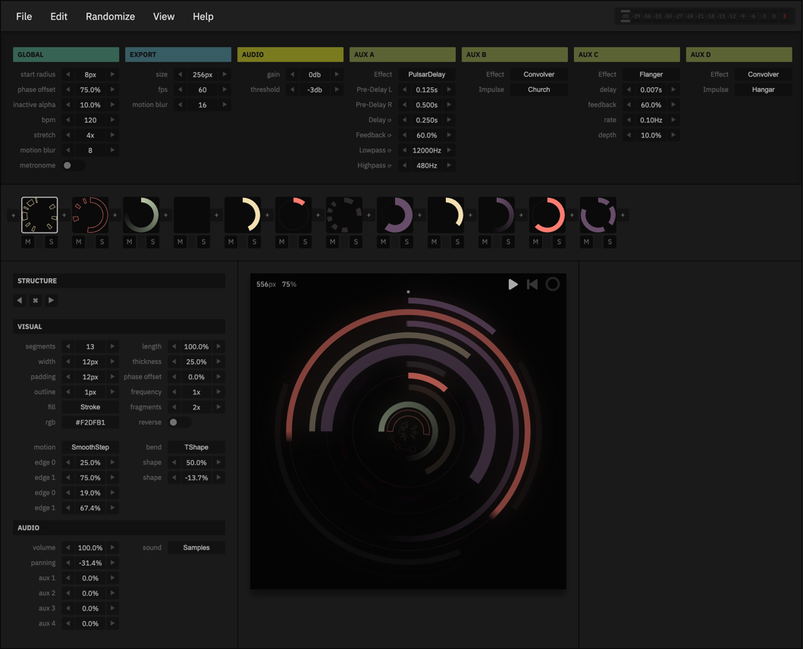

# rotary
App to generate randomized hud-circles with audio-samples and fx. 

### Chrome Only
* [Editor](https://andremichelle.github.io/rotary/)
* [Infinite circles](https://andremichelle.github.io/rotary/infinite.html)

## Build
Make sure to have sass installed and run in the console:

    sass sass/main.sass:bin/main.css --watch

Make sure to have typescript installed and run in the console:

    tsc -p ./typescript/tsconfig.json --watch

# Misc
* [Wiki Todos](https://github.com/andremichelle/rotary/wiki)